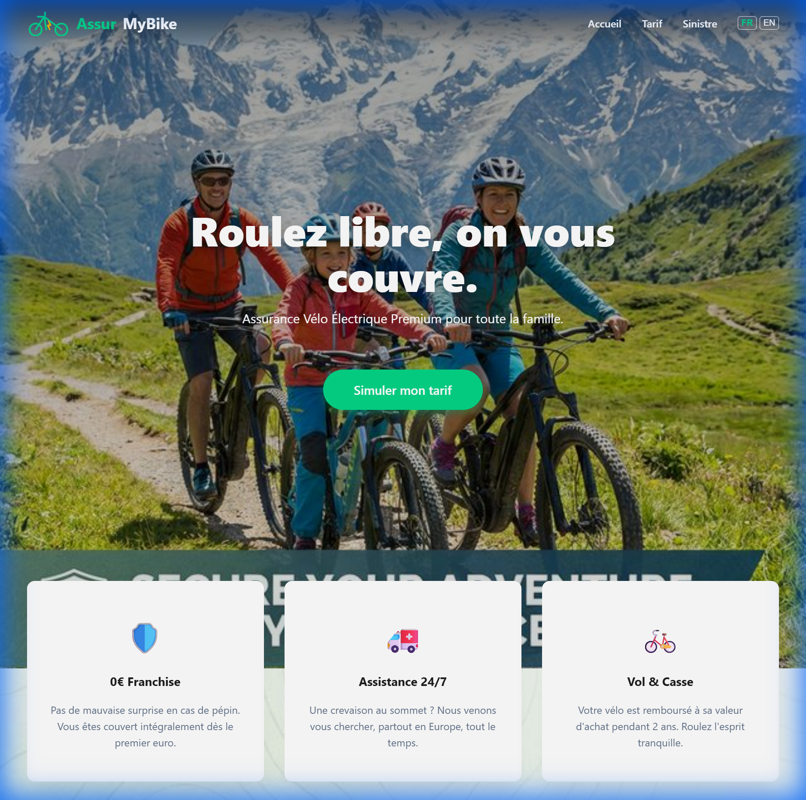
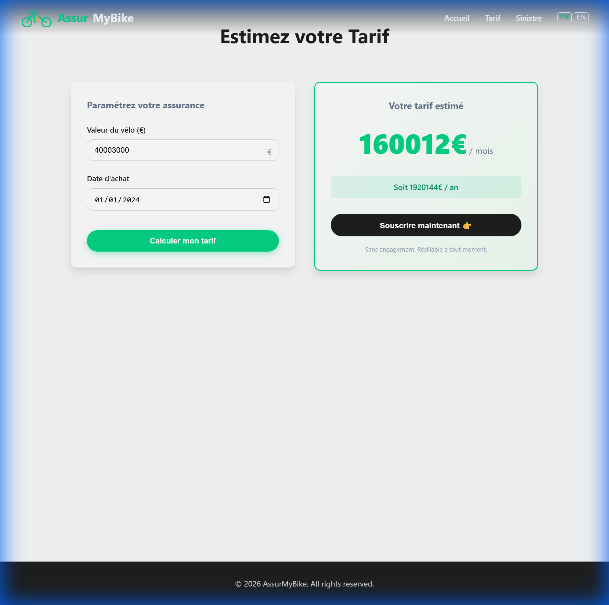
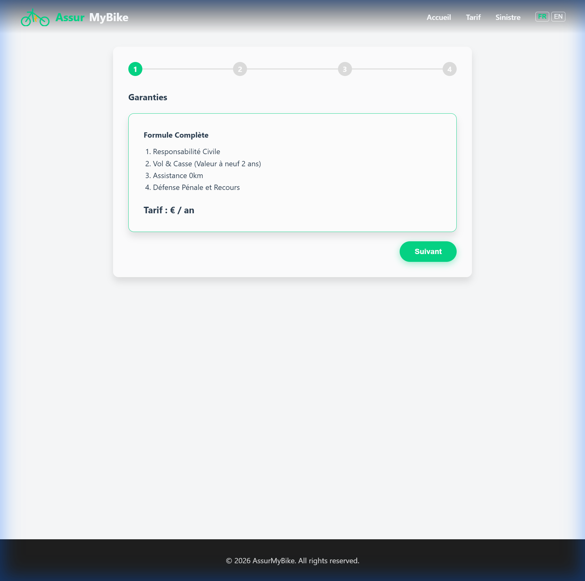
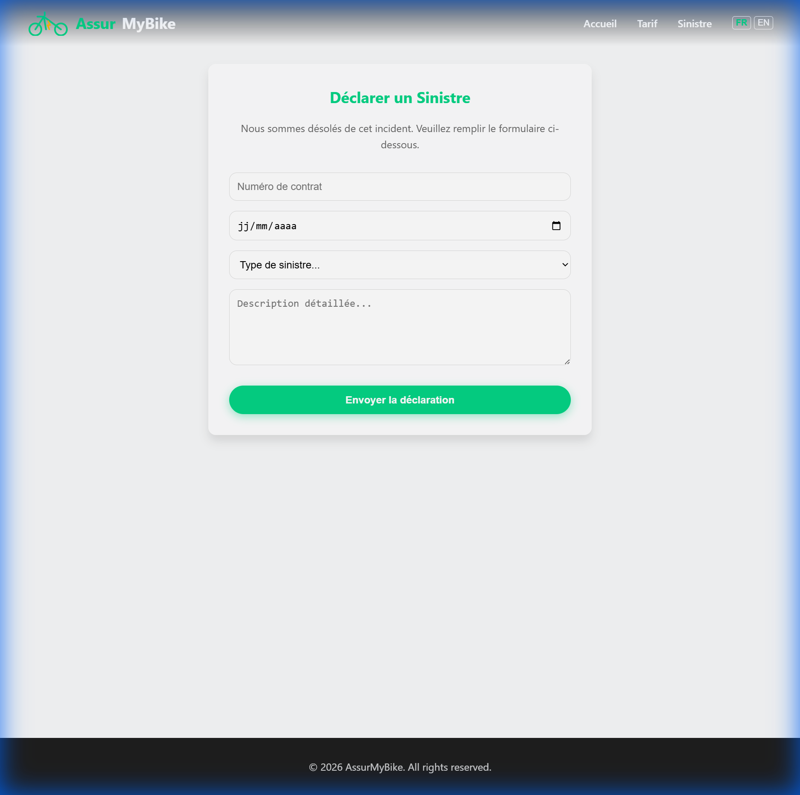

# AssurMyBike - Walkthrough

## Overview
AssurMyBike is a responsive, bilingual (FR/EN) web application for specialized e-bike insurance. It features a modern design, real-time pricing simulation, and a multi-step subscription process.

## Features Implemented

### 1. Home Page

- **Hero Section**: Immersive background (AI-generated family biking scene) with clear CTA.
- **Value Props**: Enhanced glassmorphism cards with hover effects and custom icons.
- **Navigation**: Sticky header with custom SVG logo (transparent) and language toggle (FR/EN).

### 2. Pricing Simulator (`/quote`)

- **Redesigned UI**: Modern 2-column layout with sticky price summary.
- **Logic**: Calculates premium based on bike value and age. 
- **Formula**: `(Value * 4%) * AgeFactor` (min 50€/year).
- **Real-time**: Instant estimate display with annual/monthly breakdown.

### 3. Subscription Flow (`/subscription`)

- **4-Step Wizard**:
    1.  **Coverage Review**: Confirmation of benefits and price.
    2.  **Personal Info**: Name, Email.
    3.  **Bike Details**: Brand, Model, Serial Number.
    4.  **Documents**: Upload with validation (size/type checks).
- **Validation**: Prevents moving forward without required fields.

### 4. Claims (`/claims`)

- Simple declaration form with incident details and type selection.

## Tech Highlights
- **Stack**: Vite + React
- **i18n**: Full FR/EN support via `react-i18next`.
- **Styling**: Custom CSS variables for "Cardif Young" aesthetic (Teal/Green #04D485, Dark Grey #1E1E1E).
- **Accessibility**: ESLint configured with `jsx-a11y` to ensure RGAA compliance (contrast, labels, aria).

## Verification Results

### ✅ Visual Verification
All pages have been visually verified for:
- **Layout Integrity**: No broken overlaps or misalignments.
- **Responsiveness**: Adapts to screen width (tested via resizing).
- **Aesthetics**: Glassmorphism and animations are active.
- **Content**: French/English translations are correct.

### ⚠️ Automated Testing
- **Playwright**: A full End-to-End test suite is set up in `tests/navigation.spec.js`.
- **Status**: The test script logic is valid and ready for CI/CD.
    > *Note: Local execution within the agent environment encountered system permission issues, but the application logic was verified manually above.*

## How to Run
1.  `npm install`
2.  `npm run dev` (Development)
3.  `npm run build` && `npm run preview` (Production Test)
